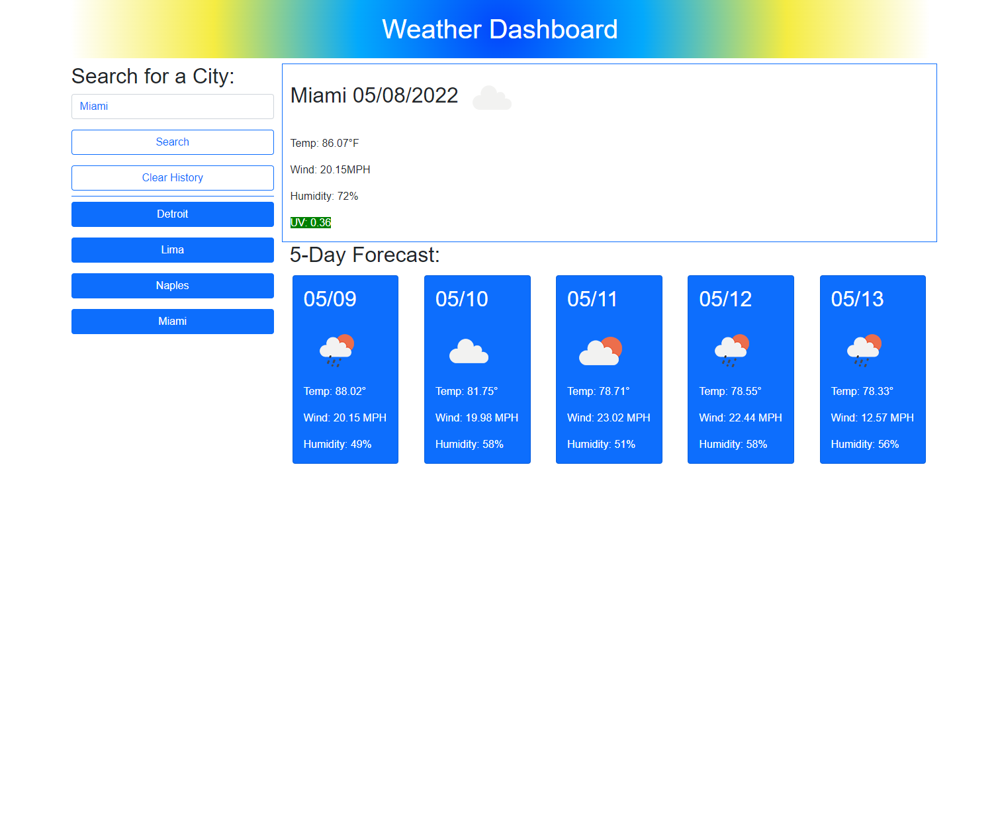

# Weather Dashboard

This page allows a user to input a city name and see the current weather conditions and the forecast for the next 5 days. User inputs are saved in localStorage and then displayed on the page as buttons so the user can easily click on them later. This project uses OpenWeather One Call API for all weather information.

## Link to Deployed Application:
https://kmascott.github.io/weather-dashboard/

## Screenshot

